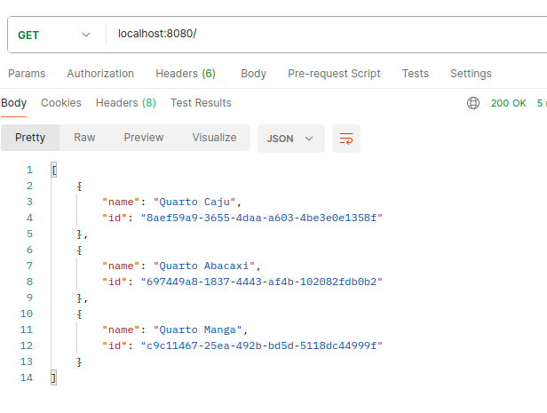
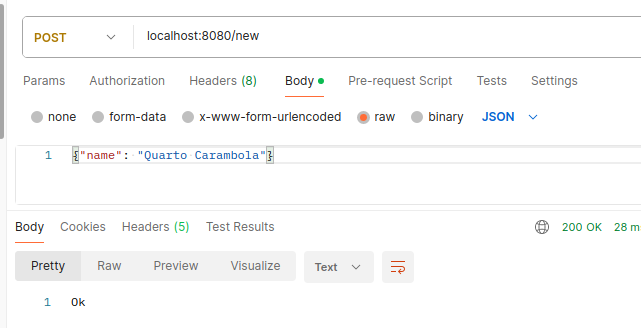
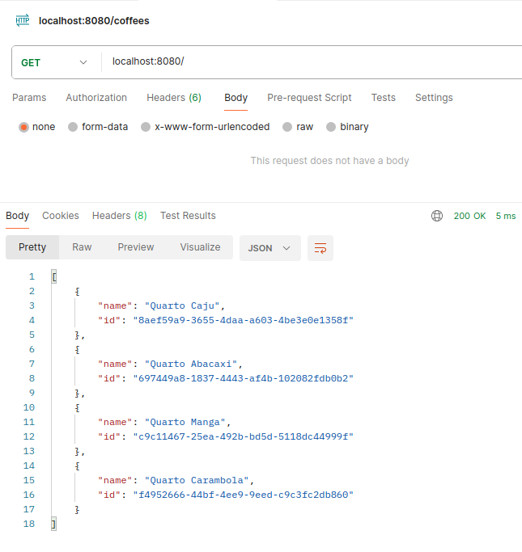
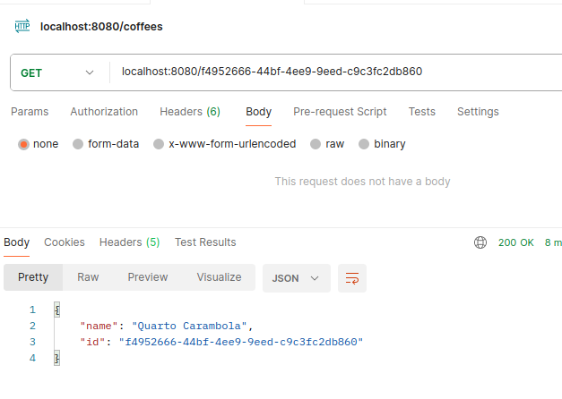
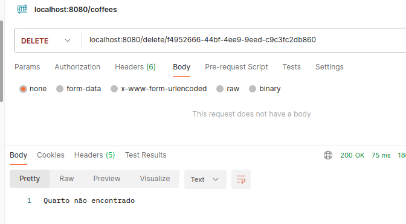
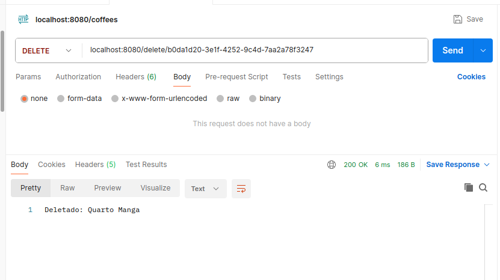
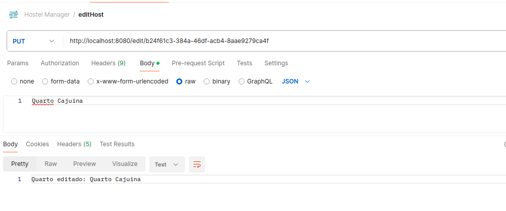
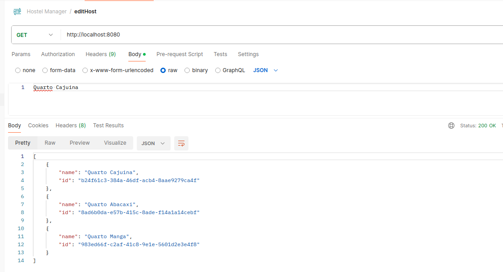

## GET - Listando todos os quartos 

## Post - Criando um quarto 

## GET - Listando todos os quartos para verificar quarto Carambola lá!

## GET - Exibindo um quarto específico via ID

## DELETE - Deletando um quarto que não existe

## DELETE - Deletando um quarto que existe

## EDIT - Editando quarto Caju para Cajuína

## GET - Listando todos os quartos para verificar quarto Cajuína editado

